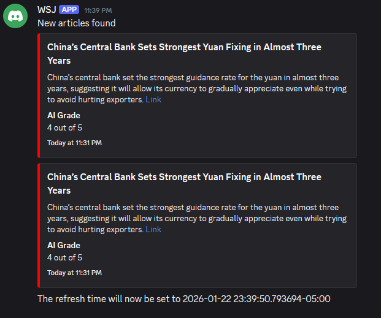

# Wall Street Journal News Aggregate

## Description

A Wall Street Journal Aggregator that presents newly published news articles in an easily accessible way using the Wall Street Journal RSS feed

## Getting Started

### Dependencies

This project requires BeautifulSoup4 for XML parsing and requests for fetching feeds.
While optional, discord.py and google gemini's libraries are also recommended if users would like to use the discord tool feature

### Installing

Clone the repository: git clone https://github.com/markm101/WSJ-Aggregator cd WSJ-Aggregator

Install Beautiful Soup and Requests: pip install beautifulsoup4 requests
Install discord.py and google gemini: pip install google-genai py-cord
Alternatively, discord.py can also be used for the project 

### Executing program

Adjust limit date within main.py
Run the mainscript to write the latest headlines to out.txt:
User selects the timezone and a limit date (blank if no limit date is needed)
```
python main.py
```

### Output Sample

The generated out.txt would look something like this
```
Global Markets Rally Amid Tech Surge    || 01/05/26 at 23:10 EST || Markets || https://wsj.com/articles/sample-link
```
When generating a live feed to console the output will look the same

When generating a live feed to discord, the output would be an embed styled like so


## License

This project is licensed under the MIT License - see the LICENSE.md file for details

## Acknowledgments

* [WSJ](WSJ.com)
* [MORSS](https://morss.it/)
* [Py-Cord](https://pycord.dev/)