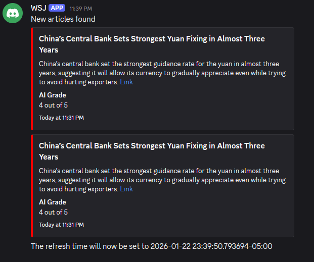

# Wall Street Journal News Aggregator

A Wall Street Journal news aggregator that fetches and displays newly published articles from WSJ RSS feeds. Supports a live web interface, console output, and Discord bot integration with optional AI grading.

## Web Interface

The primary way to use this project is via the web interface, which displays articles in real time with category filters, timezone selection, and dark/light mode.



The web server fetches all feeds every 10 minutes and caches the results. The frontend polls the API and updates automatically.

## Getting Started

### Dependencies

Install core dependencies (required for the web server):

```
pip install -r requirements.txt
```

Optional dependencies for Discord bot and AI grading:

```
pip install py-cord google-genai
```

### Running the Web Server

```
uvicorn api:app
```

The frontend will be served at `http://localhost:8000`.

### Running the CLI

```
python main.py
```

Select from the following modes:
- Write latest headlines to `output.txt`
- Console live feed (polls at a user-specified interval)
- Discord bot with optional Gemini AI article grading

## License

This project is licensed under the MIT License - see the LICENSE file for details.

## Acknowledgments

* [WSJ](https://wsj.com)
* [Py-Cord](https://pycord.dev/)
